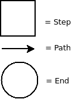

Introduction
============

StepBundle is a Symfony2 Bundle which allow you to simplify the creation of an
interaction's workflow with a cybernaute.
At first, you have to define a map and imagine every screen (web page) as a step,
then you have to linked every steps using a path.
We will use the navigator's metaphor during the whole documentation.

### What is a map ?

A map is a whole of process possibities composed of steps and paths.

### What is a step ?

A step is a potential passage's way.

### What is a path ?

A path define a ride which has a step to origin and zero or more steps to destination.

### Legend

We will use diagram :
- arrays symbolize paths
- squares symbolize steps

## Why use the StepBundle ?

It allows to define some simple process (one step, one path) and complex (more steps
and more conditionnals's paths) easily starting from a configuration which represents
the map, using yml or json.
Also, you can represente a map using directement the object's programmation but this
is less maintainable and readable.

You can use this Bundle to create a contact form, a inscription process, a survey,
an enquiry...

To continue, here's a technical presentation.
