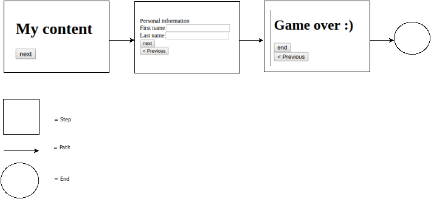

Presentation
============

Creating a Simple Map
---------------------

Building the Map
----------------

We have to create a map before rendering it.
For now, this can all be done from inside a controller.

```php
// src/AppBundle/Controller/DefaultController.php
namespace AppBundle\Controller;

use Sensio\Bundle\FrameworkExtraBundle\Configuration\Route;
use Symfony\Bundle\FrameworkBundle\Controller\Controller;
use Symfony\Component\HttpFoundation\Request;
use Sensio\Bundle\FrameworkExtraBundle\Configuration\Method;
use Sensio\Bundle\FrameworkExtraBundle\Configuration\Template;

class DefaultController extends Controller
{
    /**
     * @Route("/contact/", name="test")
     *
     *
     * @Method({"GET", "POST"})
     * @Template()
     */
    public function contactAction(Request $request)
    {
        $map = $this
            ->get('idci_step.map.builder.factory')
            ->createNamedBuilder('test map')
            ->addStep('intro', 'html', array(
                'title'       => 'Introduction',
                'description' => 'The first step',
                'content'     => '<h1>My content</h1>',
            ))
            ->addStep('personal', 'form', array(
                'title'            => 'Personal information',
                'description'      => 'The personal data step',
                'builder' => $this->get('form.factory')->createBuilder()
                    ->add('first_name', 'text', array(
                        'constraints' => array(
                            new \Symfony\Component\Validator\Constraints\NotBlank()
                        )
                    ))
                    ->add('last_name', 'text')
                ,
            ))
            ->addStep('end', 'html', array(
                'title'       => 'End',
                'description' => 'The last step',
                'content'     => '<h1>Game over :)</h1>',
            ))
            ->addPath(
                'single',
                array(
                    'source'       => 'intro',
                    'destination'  => 'personal',
                    'next_options' => array(
                        'label' => 'next',
                    ),
                )
            )
            ->addPath(
                'single',
                array(
                    'source'       => 'personal',
                    'destination'  => 'end',
                    'next_options' => array(
                        'label' => 'next',
                    ),
                )
            )
            ->addPath(
                'end',
                array(
                    'source'       => 'end',
                    'next_options' => array(
                        'label' => 'end',
                    ),
                )
            )
            ->getMap($request)
        ;

        $navigator = $this
            ->get('idci_step.navigator.factory')
            ->createNavigator($request, $map)
        ;

        if ($navigator->hasFinished()) {
            $navigator->clear();

            return $this->redirect($navigator->getFinalDestination());
        }
        if ($navigator->hasNavigated() || $navigator->hasReturned()) {
            return $this->redirect($this->generateUrl('test', $navigator->getUrlQueryParameters()));
        }

        return array('navigator' => $navigator);
    }
}
```


Rendering the Map
-----------------

Well, we have created a map, now we need to render it.
We have to use some functions and write that in the
`Contact.html.twig` file.

This is the minimal code you need to make StepBundle work.

```twig



    {{ parent() }}
    {{ step_stylesheets(navigator) }}



    {{ parent() }}
    {{ step_javascripts(navigator) }}



    {{ step(navigator) }}

```

Handling Map Submissions
------------------------
TODO expliquer hasReturn, etc

Built-in Field Types
--------------------

TODO html/form
TODO Single/etc

* [Configuration Example](configurationExample.md)

